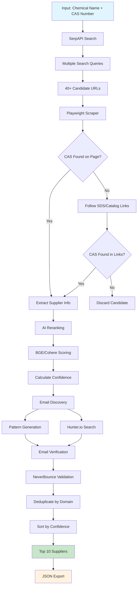

# Chemical Supplier Discovery Agent

An AI-powered system that finds chemical suppliers with verified evidence of product availability. This production-ready solution provides both a command-line interface and a REST API for integration with procurement systems.

## Quick Start

### 1. Setup (Already Done)
```bash
# Dependencies are already installed
# Playwright browsers are already installed
```

### 2. Add Your API Key
Edit your `.env` file and add your SerpAPI key:
```bash
SERPAPI_KEY=your_actual_serpapi_key_here
```

Get a free SerpAPI key at: https://serpapi.com

### 3. Run Searches

**Simple Terminal Usage:**
```bash
python3 search.py "Chemical Name" "CAS-Number"
```

**Examples:**
```bash
python3 search.py "N-Methyl-2-pyrrolidone" "872-50-4"
python3 search.py "Eucalyptol" "470-82-6"
python3 search.py "Polysorbate 80" "9005-65-6"

# Exclude suppliers from specific countries
python3 search.py "Eucalyptol" "470-82-6" --exclude cn,de
python3 search.py "Potassium methoxide" "865-33-8" --exclude="China,Germany"

# Include suppliers from specific countries ONLY
python3 search.py "Acetone" "67-64-1" --only us,ca
python3 search.py "Ethanol" "64-17-5" --only="United States,United Kingdom"
```

**Country Filtering:**
- `--exclude`: Filter out suppliers from specific countries
- `--only`: Include suppliers from specific countries ONLY
- Both support country codes (`cn`, `de`, `us`) and full names (`China`, `Germany`, `United States`)
- Cannot use both flags together

Common country codes: `us`, `uk`, `de`, `fr`, `cn`, `jp`, `in`, `ca`, `au`, `sg`

**Advanced CLI:**
```bash
python3 -m app.main --name "Chemical Name" --cas "CAS-Number" --limit 5
```

**Production API:**
```bash
# Start FastAPI server
uvicorn api:app --host 0.0.0.0 --port 8000

# Docker deployment
docker-compose up -d

# API documentation available at http://localhost:8000/docs
```

## What You Get

For each supplier found:
- **Supplier name** and **website**
- **Country** (detected from domain/content)
- **Contact email** (when available)
- **Evidence URL** (catalog/SDS page proving they sell the chemical)
- **Confidence score** (0-10 based on evidence quality)

## Project Structure

```
vald/
├── api.py                 # FastAPI production server
├── search.py              # Simple terminal interface
├── app/
│   ├── main.py           # Advanced CLI
│   ├── agent.py          # Main orchestration logic
│   ├── search_serpapi.py # Web search via SerpAPI
│   ├── scrape_playwright.py # Web scraping & evidence extraction
│   ├── rerank.py         # AI-powered relevance scoring
│   └── schema.py         # Data models (Pydantic)
├── docker-compose.yml    # Container orchestration
├── Dockerfile            # Container build configuration
├── requirements.txt      # Python dependencies
├── env.example          # Environment template
├── DEPLOY.md            # Production deployment guide
└── README.md            # This file
```

## API Requirements

| Service | Purpose | Cost | Required |
|---------|---------|------|----------|
| [SerpAPI](https://serpapi.com) | Google search results | Free: 100/month, Paid: $50/5K | **Required** |
| [Hunter.io](https://hunter.io) | Email discovery | Free: 50/month | Optional |
| [NeverBounce](https://neverbounce.com) | Email verification | Pay-per-use | Optional |

*Note: Agent works with just SerpAPI. Email APIs improve contact discovery.*

## Example Output

```bash
$ python3 search.py "Eucalyptol" "470-82-6"

Searching for: Eucalyptol
CAS Number: 470-82-6
This may take 1-2 minutes...

Found 8 suppliers
================================================================================

1. Sigma-Aldrich
   Website: https://sigmaaldrich.com
   Country: United States
   Email: orders@sigmaaldrich.com [FOUND]
   Evidence: https://sigmaaldrich.com/catalog/product/sigma/e3700
   Confidence: 9.2/10

2. TCI America
   Website: https://tciamerica.com
   Country: United States
   Email: info@tciamerica.com [PATTERN]
   Evidence: https://tciamerica.com/en/p/E0049
   Confidence: 8.7/10

Full results saved to: Eucalyptol_470_82_6.json
```

## Test Chemicals

Try these examples from the original specification:

```bash
python3 search.py "2-chloro-para-phenylenediamine" "615-66-7"
python3 search.py "Potassium methoxide" "865-33-8"
python3 search.py "Poly(Ethylene-co-1-butene)" "25087-34-7"
python3 search.py "Silica (Amorphous)" "7631-86-9"
python3 search.py "Carbomer" "9003-01-4"
```

## How It Works



### Process Details

1. **Search**: Uses SerpAPI to find supplier candidates
2. **Scrape**: Uses Playwright to extract supplier info and verify CAS numbers
3. **Rank**: Uses AI to score relevance and evidence quality
4. **Enrich**: Discovers and verifies contact emails
5. **Return**: Top 10 suppliers with evidence links

## Limitations

- Only searches publicly accessible websites
- Cannot access login-protected catalogs
- Better coverage for US/EU suppliers
- CAS validation is string-based (not chemical structure)

## Design and Why

### MVP Approach

This system is designed as a **Minimum Viable Product (MVP)** that demonstrates core chemical supplier discovery capabilities within a 3-hour development timeframe. The architecture prioritizes:

**Core Functionality:**
- Reliable web search via SerpAPI
- Evidence-based supplier validation (CAS number verification)
- Geographic filtering for procurement policies
- AI-powered relevance ranking
- Structured data output

**📧 Email Discovery - Simplified Approach:**
The current system uses a pattern-based approach for email discovery:
- Extracts emails found on scraped pages (`[FOUND]`)
- Generates common patterns like `info@domain.com` (`[PATTERN]`)

### Future Enhancements

With additional development time, the system could be enhanced with:

**Advanced Email Discovery:**
- **Hunter.io Integration**: Professional email discovery service with higher accuracy
- **NeverBounce Integration**: Email deliverability verification to reduce bounce rates
- **Multiple pattern generation**: sales@, contact@, support@ variations

**Additional Improvements:**
- **Cache Layer**: Redis caching for faster repeated searches
- **Rate Limiting**: Built-in throttling for API calls
- **Batch Processing**: Handle multiple chemicals simultaneously
- **Advanced Parsing**: PDF content extraction from SDS documents
- **Company Profiles**: Detailed supplier information and ratings
- **Integration APIs**: Connect with ERP/procurement systems

### Architecture Decisions

**Why SerpAPI?** Reliable, legal access to Google search results without CAPTCHA issues.

**Why Playwright?** Handles modern SPAs and JavaScript-rendered content that simple HTTP requests miss.

**Why BGE Reranker?** Provides semantic relevance scoring without requiring external API dependencies.

**Why Country Detection?** Essential for compliance, logistics, and procurement policy enforcement.

=
